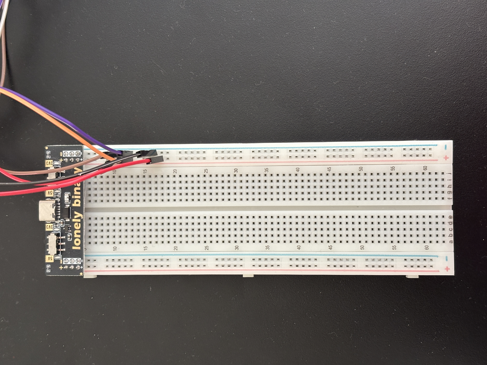
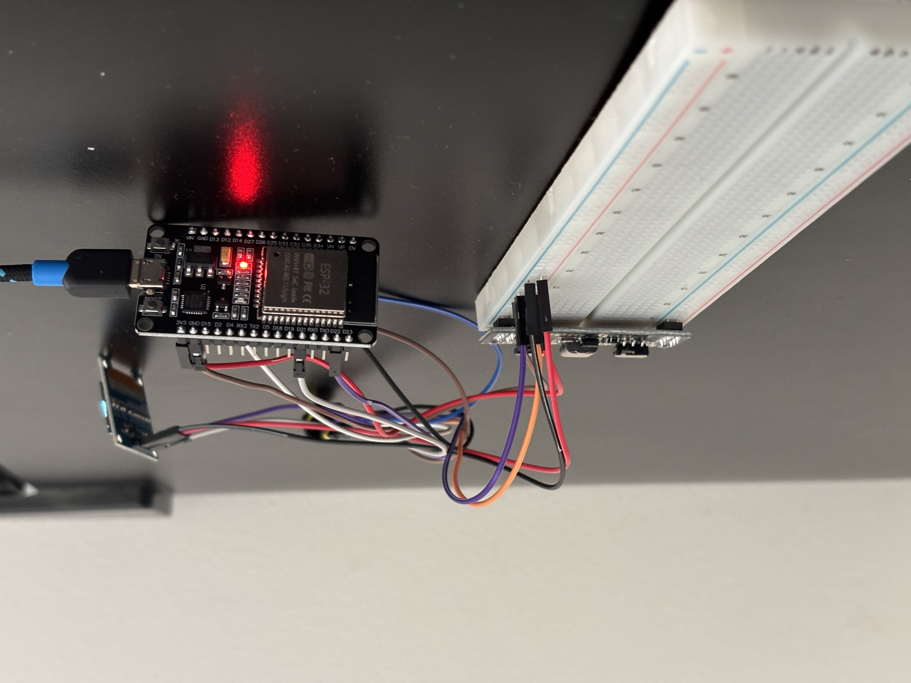
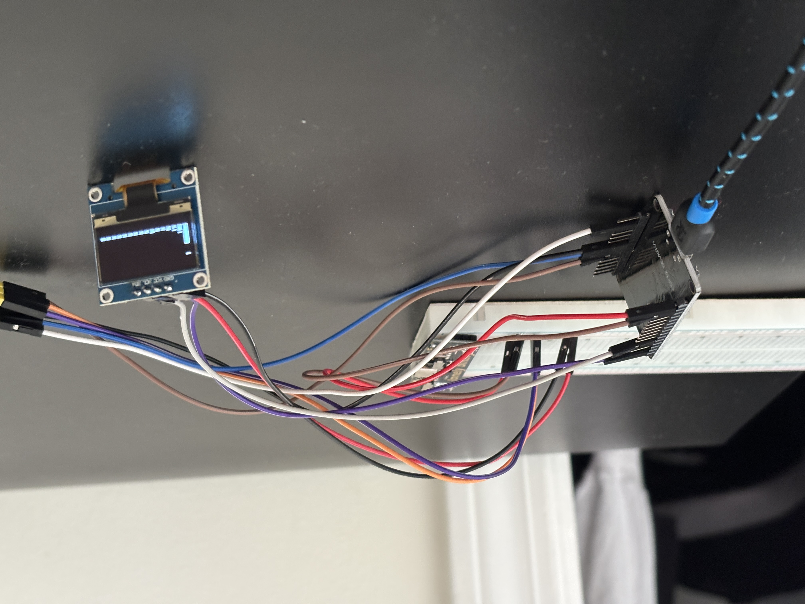
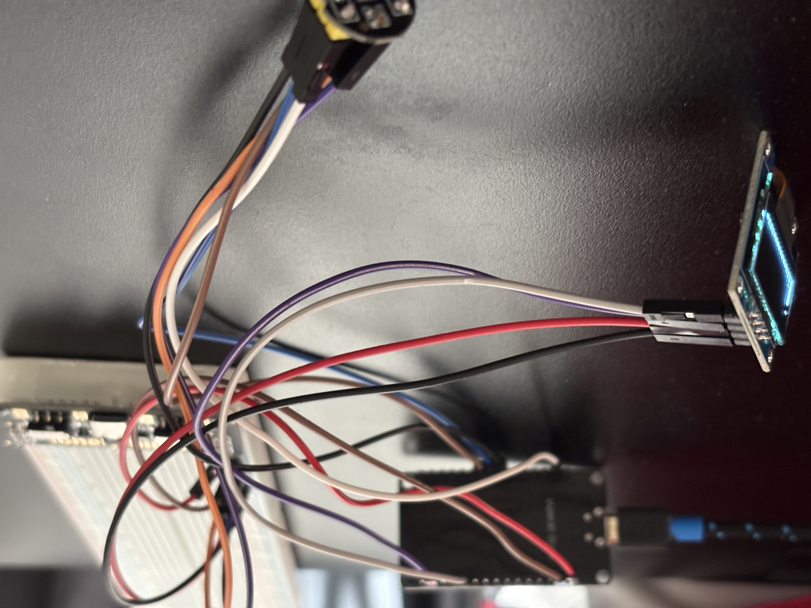
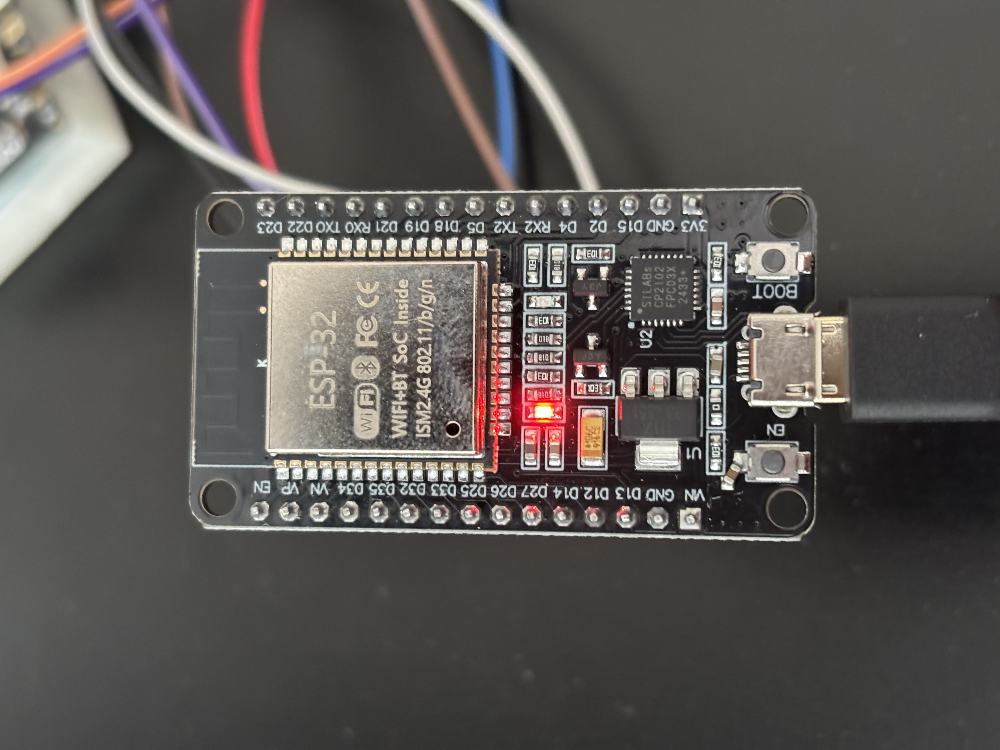
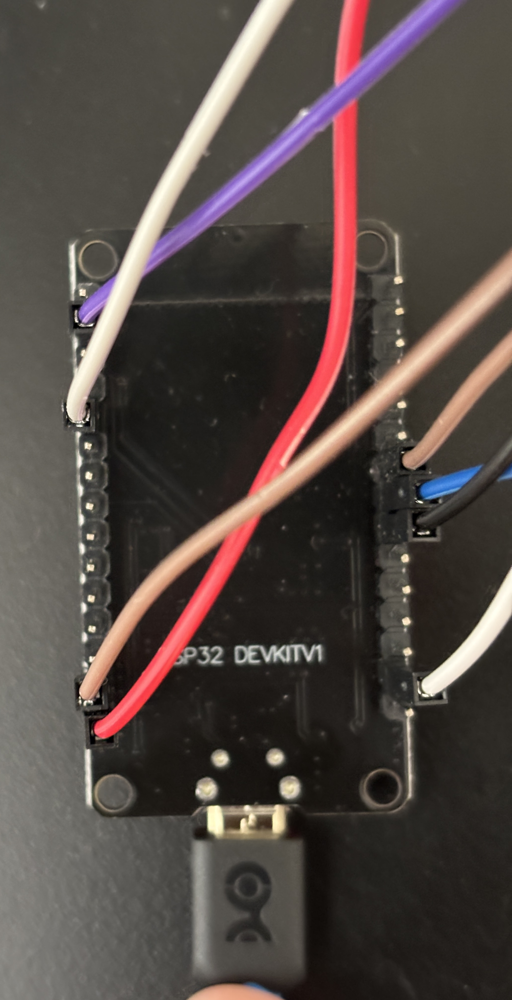
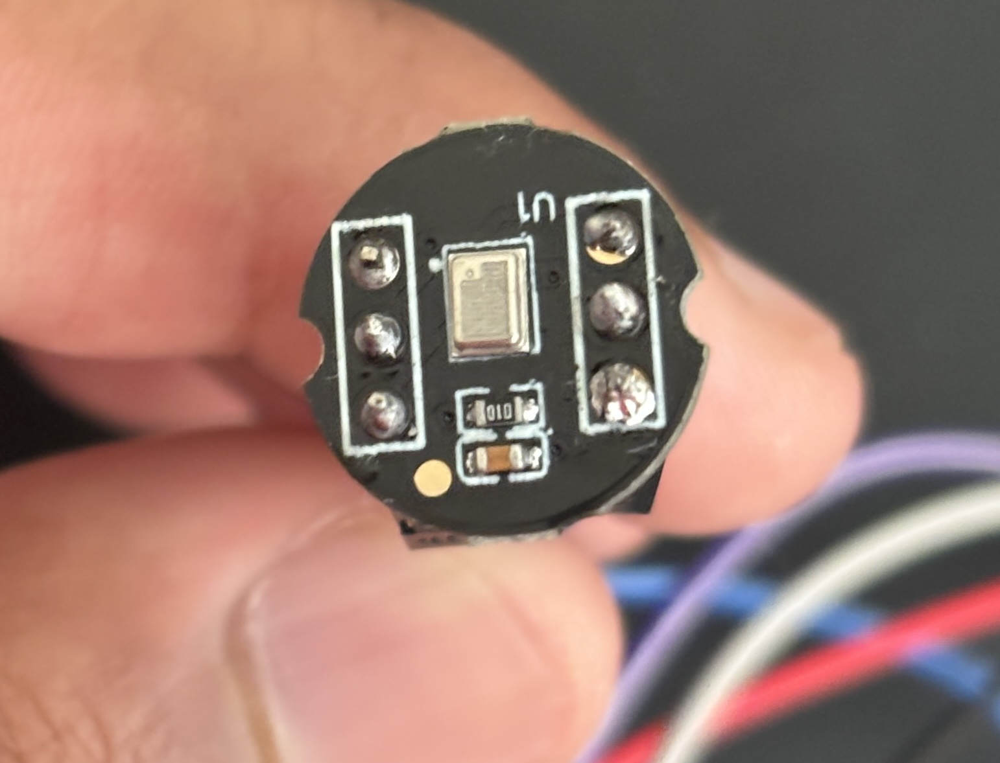
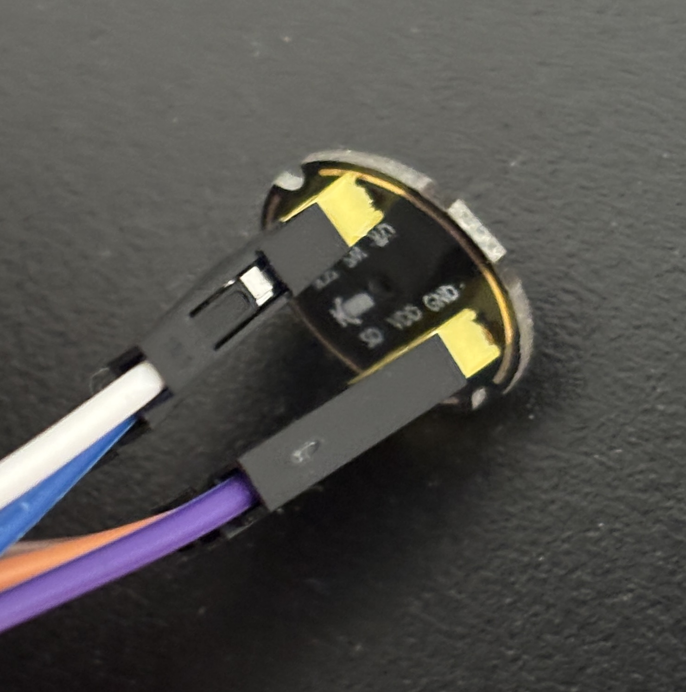
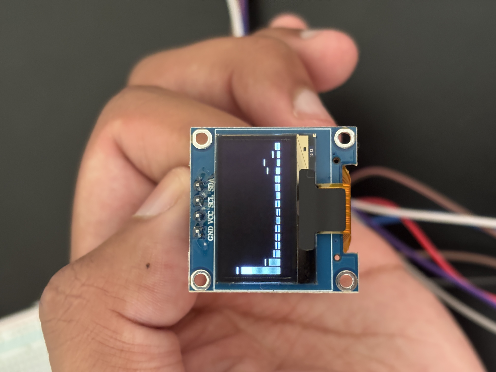
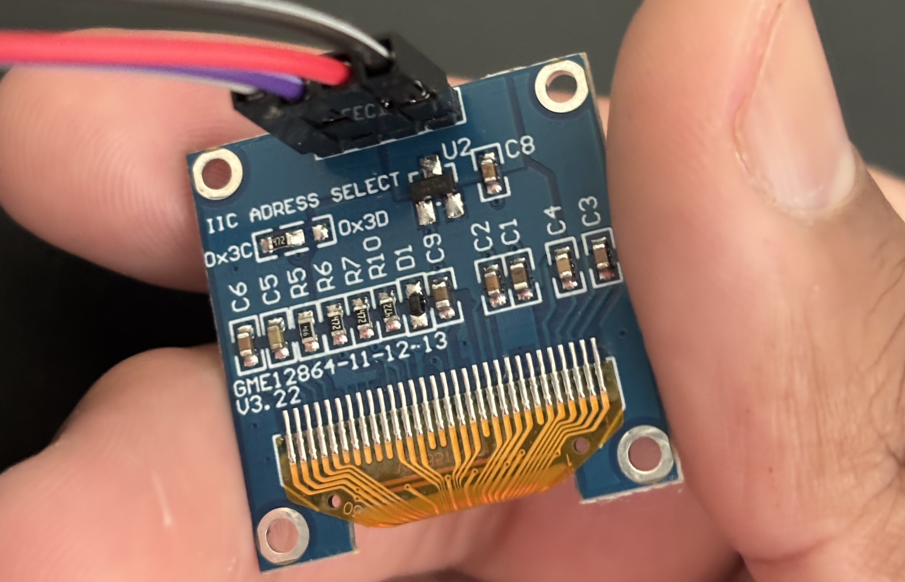

# ESP32 Audio Spectrum Analyzer

A real-time audio spectrum analyzer built on the ESP32, featuring a custom-designed PCB. Captures audio via an I2S MEMS microphone, runs FFT processing on-chip, and displays a live 16-bar frequency spectrum on an OLED display. All components were hand-soldered onto a custom PCB manufactured by JLCPCB.

---

## Demo Videos

**Analyzer reacting to noise:**

https://github.com/JadenS180/spectrum-analyzer/raw/main/media/spectrum-DemoNoise.MOV

**Analyzer in a quiet environment:**

https://github.com/JadenS180/spectrum-analyzer/raw/main/media/spectrum-DemoQuiet.MOV

---

## Photos

### Full Breadboard Build


### Side Views




### Components
| | |
|---|---|
|  |  |
| ESP32-WROOM-32 (front) | ESP32-WROOM-32 (back) |
|  |  |
| INMP441 Microphone (front) | INMP441 Microphone (back) |
|  |  |
| SSD1306 OLED (front) | SSD1306 OLED (back) |

---

## Features

- Real-time FFT using 512-sample windows at 44,100 Hz
- 16 frequency bars mapped across the audible spectrum
- Hann windowing to reduce spectral leakage
- Peak hold indicators on each bar
- DC/low-frequency noise suppression via bin offset
- Fully custom 2-layer PCB designed in KiCad and manufactured by JLCPCB

---

## Hardware

| Component | Description |
|---|---|
| ESP32-WROOM-32 | Microcontroller |
| INMP441 | I2S MEMS microphone |
| SSD1306 | 0.91" I2C OLED display (128x32) |
| AMS1117-3.3 | 3.3V LDO voltage regulator |
| USB-C Receptacle | Power input |

### Pin Mapping

| Signal | ESP32 GPIO |
|---|---|
| I2S SCK | 26 |
| I2S WS | 25 |
| I2S SD | 33 |
| I2C SDA | 21 |
| I2C SCL | 22 |

---

## Firmware

Written in Arduino C++ using the Espressif ESP32 package (v3.3.10).

**Dependencies:**
- [arduinoFFT](https://github.com/kosme/arduinoFFT)
- [Adafruit SSD1306](https://github.com/adafruit/Adafruit_SSD1306)
- [Adafruit GFX Library](https://github.com/adafruit/Adafruit-GFX-Library)

**To flash:**
1. Open firmware/spectrum_analyzer.ino in Arduino IDE
2. Select board: ESP32 Dev Module under Espressif Systems
3. Connect ESP32 via USB and select the correct port
4. Upload

---

## PCB Design

Designed in KiCad. The board is a 2-layer FR-4 PCB with a filled GND copper pour on F.Cu and a keep-out zone over the ESP32 antenna. Manufactured by JLCPCB. All components were hand-soldered onto the finished board.

*Photos of the assembled PCB coming soon.*

KiCad schematic, PCB layout, and Gerber files are in the hardware/ directory.

---

## Repository Structure

```
spectrum-analyzer/
├── firmware/
│   └── spectrum_analyzer.ino
├── hardware/
│   ├── spectrum_analyzer.kicad_pro
│   ├── spectrum_analyzer.kicad_sch
│   ├── spectrum_analyzer.kicad_pcb
│   └── gerbers/
├── media/
│   ├── (photos)
│   └── (videos)
└── README.md
```

---

## Author

Jaden Smiles — [github.com/JadenS180](https://github.com/JadenS180)
